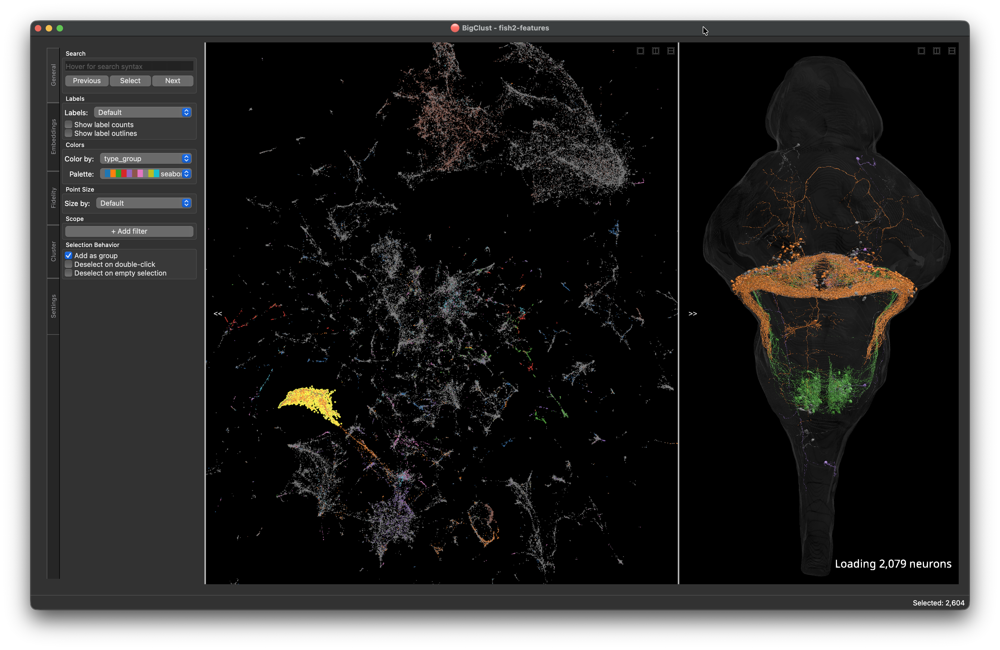

<div class="bc-section" markdown>

## Try it without building anything

```bash
uvx bigclust2@latest --from https://flyem.mrc-lmb.cam.ac.uk/flyconnectome/bigclust_data/examples/MaleCNS_FlyWire_hemibrain_central_brain_bigclust
```

That opens a public example project: **87,263 central brain neurons from FlyWire,
MaleCNS and Hemibrain**, co-clustered by connectivity and streamed straight over
HTTP. No account, no credentials, nothing to download first.

Select a cluster and the 3D viewer shows you those neurons from all three
connectomes at once, in a common space.

[About the example dataset &rarr;](get-started/example-dataset.md) ·
[Installation &rarr;](get-started/installation.md)

</div>

<div class="bc-section" markdown>

## What you are looking at

Every region of the window has a page behind it. Click a number.

<div class="bc-shot">
  
  <a class="bc-shot__pin" style="--x: 5.4%; --y: 31%" href="reference/widgets/#the-control-panel" title="Control panel tabs">1</a>
  <a class="bc-shot__pin" style="--x: 13%; --y: 11%" href="reference/widgets/#general" title="General tab">2</a>
  <a class="bc-shot__pin" style="--x: 44%; --y: 46%" href="concepts/selection/" title="Scatter plot">3</a>
  <a class="bc-shot__pin" style="--x: 65.5%; --y: 7.8%" href="reference/widgets/#pane-layout" title="Pane layout buttons">4</a>
  <a class="bc-shot__pin" style="--x: 82%; --y: 50%" href="reference/widgets/#the-3d-viewer" title="3D viewer">5</a>
  <a class="bc-shot__pin" style="--x: 93.5%; --y: 92.7%" href="reference/widgets/#the-status-bar" title="Status bar">6</a>
</div>

<ol class="bc-legend" markdown>
<li markdown>**Control panel tabs** — General, Embeddings, Fidelity, Cluster, Settings. Toggle the whole panel with ++c++. [Reference &rarr;](reference/widgets.md#the-control-panel)</li>
<li markdown>**General tab** — search, labels, colours, point size, scope filters. [Reference &rarr;](reference/widgets.md#general)</li>
<li markdown>**Scatter plot** — the embedding. Box- and lasso-select, grow and shrink. [How selection works &rarr;](concepts/selection.md)</li>
<li markdown>**Pane layout** — stack the two panes, put them side by side, or show one. [Reference &rarr;](reference/widgets.md#pane-layout)</li>
<li markdown>**3D viewer** — the neurons behind the selected points. [Reference &rarr;](reference/widgets.md#the-3d-viewer)</li>
<li markdown>**Status bar** — how many points are selected, plus the meta-staleness banner. [Reference &rarr;](reference/widgets.md#the-status-bar)</li>
</ol>

</div>

<div class="bc-section" markdown>

## Three things it does that a notebook doesn't

<div class="bc-grid" markdown>

<div class="bc-card" markdown>

<span class="bc-card__icon">:material-lasso:</span>

### Selection is the interface

Lasso a blob of points and the 3D viewer fills with those neurons. Grow the
selection to pull in nearest neighbours, shrink it to step back, hide what you
have already dealt with.

Selections carry across every widget at once — the connectivity table, the
distance heatmap and the feature comparison all follow the same set of points.

[How selection works &rarr;](concepts/selection.md)

</div>

<div class="bc-card" markdown>

<span class="bc-card__icon">:material-chart-scatter-plot:</span>

### Reclustering is a button, not a rerun

The embedding and the clustering are both recomputed in the app, from the same
distances or features the project shipped with. Change the metric, switch UMAP
for t-SNE, drop the feature groups you don't care about — the points animate to
their new positions and every open widget follows.

[Recompute the embedding &rarr;](how-to/recompute-embeddings.md) ·
[Recluster &rarr;](how-to/recluster.md)

</div>

<div class="bc-card" markdown>

<span class="bc-card__icon">:material-cloud-upload-outline:</span>

### Annotations go home

The type you decide on in the scatter plot can be written straight back to Clio,
SeaTable/FlyTable or a CSV — with a mandatory validation step against the live
backend before the first write is allowed.

[Push annotations &rarr;](how-to/push-annotations.md) ·
[Backends &rarr;](reference/backends.md)

</div>

</div>
</div>

<div class="bc-section" markdown>

## A project is a directory

BigClust does not take a distance matrix as an argument. It takes a *directory* —
local or over HTTP — holding the data plus an `info` file that says what the data
is. This is the Neuroglancer model, and it means a clustering can be published at
a URL and opened by anyone with the link.

```
/my_clustering/
    info                <- JSON: what is here and how to read it
    meta.parquet        <- one row per neuron: id, label, dataset, …
    embeddings.parquet  <- the 2D coordinates the scatter plot draws
    distances.parquet   <- pairwise distances        (optional)
    features.parquet    <- the high-dimensional data (optional)
```

```bash
uvx bigclust2@latest --from https://example.org/my_clustering
```

Only `info` and `meta` are strictly required. What you supply beyond them decides
what the app can do: without `distances` or `features` there is nothing to
recompute an embedding *from*, so the Embeddings and Cluster tabs have no input
to offer.

Building one is a short script — no database, no import step, no server.

[Create a local dataset &rarr;](how-to/create-a-local-dataset.md) ·
[Why directories &rarr;](concepts/data-sources.md) ·
[Full data format &rarr;](reference/data-format.md)

</div>

<div class="bc-section" markdown>

## Get going

<div class="bc-grid" markdown>

<div class="bc-card" markdown>

### :material-download: Install

```bash
uvx bigclust2@latest
```

No environment to create — `uvx` fetches and runs it. There is nothing to
configure until you want to write annotations.

[Installation &rarr;](get-started/installation.md) ·
[Example dataset &rarr;](get-started/example-dataset.md)

</div>

<div class="bc-card" markdown>

### :material-school: Learn by doing

Nine short recipes, each one a numbered set of steps for a single task: load a
remote dataset, recluster it, push what you found back to Clio.

[How-to guides &rarr;](how-to/index.md)

</div>

<div class="bc-card" markdown>

### :material-keyboard: Look things up

Every keyboard shortcut, every widget, every menu item and the complete `info`
file specification.

[Reference &rarr;](reference/index.md)

</div>

</div>
</div>

<div class="bc-section" markdown>

## What it isn't

BigClust does not compute your clustering for you. It has no opinion about how
you built your connectivity vectors or ran your NBLAST — that happens upstream,
in something like [cocoa](https://github.com/flyconnectome/cocoa), and lands in a
project directory. What BigClust adds is the part that is genuinely hard to do in
a notebook: looking at a hundred thousand points and the neurons behind them at
the same time, and changing your mind quickly.

It is also not a proofreading tool. The 3D viewer renders meshes from a
Neuroglancer source; it does not edit them.

</div>
